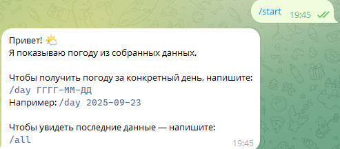
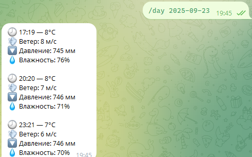
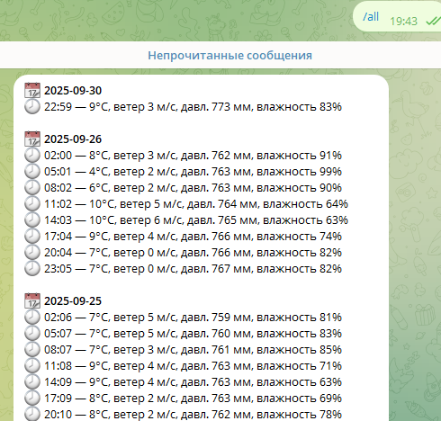

# Погодный Telegram-бот

Бот предоставляет доступ к архивным данным погоды, собранным с помощью скраппера.  
Данные хранятся в текстовом файле и обновляются вручную или автоматически.

## 📌 Возможности
- Просмотр погоды за **конкретный день**  
- Просмотр данных за **последние 7 дней** (максимум 20 записей)
- Человекочитаемый формат с эмодзи и группировкой по датам

## 📥 Команды
- `/start` — показать справку  
- `/day ГГГГ-ММ-ДД` — погода за указанный день  
  Пример: `/day 2025-09-23`  
- `/all` — последние данные за неделю

## 🚀 Установка и запуск

1. **Клонируйте репозиторий**:
   ```bash
   git clone <ваш-репозиторий>
   cd <папка-проекта>

## 📸 Примеры работы
- `/start`: 
- `/day 2025-09-23`: 
- `/all`: 